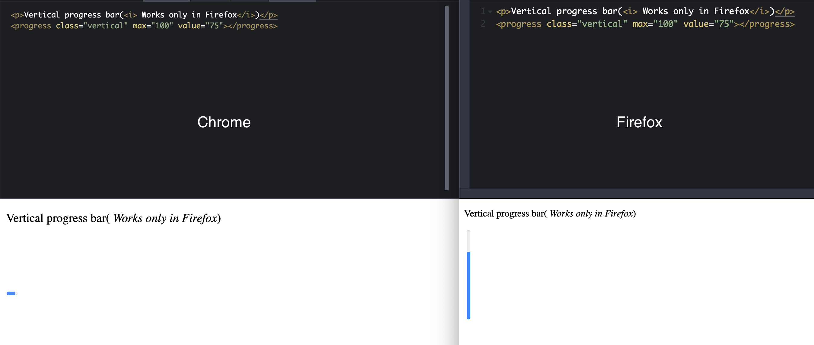

Browser vendors introduce experimental features or nonstandard CSS properties into their browsers. They do this by prefixing property names with strings that are recognized by their browser engine. When the browser scans the document and finds CSS property prefixed with the string known to the underlying engine it applies it to the current document otherwise it ignores the property. This allows browser vendors to introduce new features while the specifications are missing or immature.

## CSS Vendor Prefixes

- `-webkit-` Those starting with `-webkit-` apply to WebKit-based browsers such as Chrome, Safari, latest Opera, iOS browsers(which also includes Firefox for iOS)
- `-moz-` Properties prefixed with `-moz-` are applied to Firefox
- `-o-` old versions of Opera support properties starting with `-o-`
- `-ms-` Internet Explorer and Microsoft Edge applies properties starting with `-ms-`

## Example

`-moz-orient-` is in the experimental stage and is only implemented in Firefox. This property accepts either of four values, listed below

- `inline`
- `block`
- `horizontal` _(default)_
- `vertical`

If your current browser is Firefox you will see vertical progress bar whereas if you open this example in Chrome you will see the horizontal progress bar

  See the Pen <a href="https://codepen.io/gulshansainis/pen/povYYON">
  Example - Browser Vendor Prefixes </a> by Gulshan Saini (<a href="https://codepen.io/gulshansainis">@gulshansainis</a>)
  on <a href="https://codepen.io">CodePen</a>.

## How To Use Vendor Prefixes

In general, browsers process style properties in the order they’re listed, ignoring those properties they don’t recognize or support, so you always want the most current specifications listed last.

## Vendor Prefixes Future

Browser vendors are discouraging the use of vendor prefixes as developers use these features on the production website, despite their experimental nature. Browser vendors have started implementing experimental features behind user-controlled flags or preferences. Its is recommended to not use nonstandard features in production to avoid unnecessary issues and inconsistencies

## Helpful Resources

Below are some resources that I frequently use to spot experimental features

- [MDN Web Docs](https://developer.mozilla.org/en-US/) MDN is no. 1 resource for developers and you should bookmark the link. The HTML and CSS sections on the website have documentation for all the features that are supported by the latest browsers. Below each feature document, they have provided **Browser compatibility** section which is frequently updated and indicates whether a certain feature is implemented by the browser or not.
- [Can I use](https://caniuse.com/) Can I use is another very helpful resource where you can search for a feature and it can tell whether all browsers have implemented the same or not? It also provides links to any known issues that are specific to that feature discovered in any of major browsers
